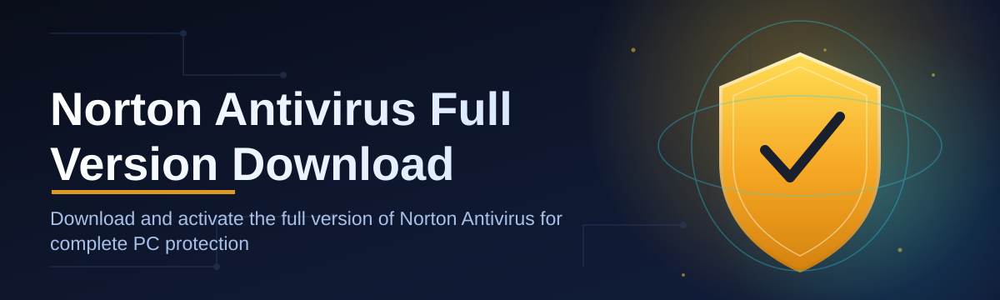
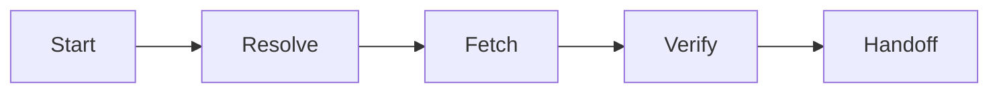

# norton-antivirus-full-download-manager 🛡️⚙️

  

| Requirement | Minimum | Recommended |
|---|---|---|
| OS | Windows 10 (64-bit) | Windows 11 (64-bit) |
| Disk Space | 350 MB free | 1 GB free |
| Memory | 4 GB RAM | 8 GB RAM |
| Network | Broadband connection | Broadband connection |
| Privileges | Standard user | Administrator (for install step) |

*A calm, transparent way to fetch, verify, and manage your Norton Antivirus full version download — without the guesswork.*

  

---

## 🔍 Overview

`norton-antivirus-full-download-manager` is a lightweight orchestration layer built around one narrow, well-defined job: making the process of obtaining a Norton Antivirus full version download predictable, auditable, and free of the ambiguity that usually surrounds third-party download pages. Rather than acting as a mirror or a repackager, the tool functions as a *routing and verification layer* — it points you to the correct installer path, checks the integrity of what lands on your disk, and gets out of the way once the job is done.

This project exists because the download experience for security software is, ironically, one of the least secure moments in a user's workflow. Search results are noisy, mirrors drift out of date, and installer bundles are frequently modified in ways that are invisible until it's too late. The manager was built to reduce that surface area: one landing page, one verified path, one predictable outcome. It is aimed at IT administrators provisioning multiple machines, home users who want a Norton Antivirus full version download without wading through ad-laden aggregator sites, and anyone who simply prefers a tool that explains itself rather than assuming trust.

Architecturally, the manager treats "download" as a *process* rather than an *event* — there is a resolution step, a validation step, and a handoff step, each of which can be inspected independently. That separation is the core design decision behind everything else in this README.

---

## 🧭 What This Manager Actually Does

- **Path resolution, not guessing** — instead of hardcoding a single mirror, the manager resolves the correct Norton Antivirus full version download endpoint at request time, reducing the chance you land on a stale or retired build.

- **Checksum-first mentality** — every fetched installer is hashed and compared against a known-good reference before it's ever surfaced as "ready," so integrity checking happens *before* trust, not after.

- **Offline-friendly staging** — once downloaded, installers are staged locally so repeat installs across a fleet of machines don't require repeated network round-trips.

- **Zero background footprint** — the manager does not install a service, does not run at startup, and does not persist beyond the session unless you explicitly ask it to.

- **Version transparency** — the interface always tells you which build year and revision you're looking at, rather than hiding version metadata behind vague "latest" labels.

- **Bundling awareness** — the tool flags optional add-on offers commonly bundled with antivirus installers, so you can decline them deliberately rather than by accident.

- **Portable-first design** — no registry sprawl, no hidden config directories scattered across the filesystem; everything the manager touches lives in one place.

- **Human-readable logs** — every action (resolve, verify, stage, handoff) is logged in plain language, so a support ticket or an audit doesn't require reverse-engineering binary logs.

> [!NOTE]
> This manager does not modify, patch, or redistribute Norton Antivirus itself. It is a download orchestration tool — the antivirus installer is fetched from its official distribution path and handed off unmodified.

---

## 🚀 How to Get Started

1. **Visit the landing page** using the download button above — this is the single source of truth for the current build.

2. **Download the manager package** for Windows 10/11 (64-bit). No dependency installers, no runtime downloads required beforehand.

3. **Run the executable** — the manager opens with a resolution screen showing the current Norton Antivirus full version download target and its checksum.

4. **Confirm and hand off** — once verification passes, the manager either launches the Norton installer directly or stages it for later use, depending on your preference in Settings.

> [!TIP]
> If you're provisioning several machines, use the "stage only" mode on the first run, then copy the staged installer folder across your fleet to avoid re-downloading on every machine.

---

## 🖥️ System Requirements

| Component | Detail |
|---|---|
| Operating System | Windows 10 or Windows 11, 64-bit only |
| Architecture | x64 (ARM64 emulation supported, not optimized) |
| Dependencies | None — standalone, self-contained executable |
| .NET / Runtime | Not required — statically bundled |
| Admin rights | Only required at the final installer handoff step |
| Internet access | Required for resolution and download; not required for staged repeat installs |

> [!IMPORTANT]
> The manager itself is fully standalone. Any prompts for administrator elevation come from the Norton installer at handoff time, not from the manager.

---

## 🏗️ How It Works

The workflow is intentionally linear — each stage has one job, and each stage can fail loudly rather than silently, which is the whole point of separating them in the first place.

1. **Resolve** — the manager queries the current distribution pointer for the correct Norton Antivirus full version download build.

2. **Fetch** — the installer package is pulled over an encrypted connection into a temporary staging area.

3. **Verify** — a checksum comparison confirms the fetched file matches the published reference hash.

4. **Stage or Launch** — depending on your settings, the verified installer is either kept for later deployment or launched immediately.

5. **Report** — a plain-language summary of the session (source, hash result, outcome) is written to the local log.

---

## 🧩 Troubleshooting

<strong>The manager says "checksum mismatch" — is this normal?</strong>

No. A mismatch means the fetched file does not match the expected reference hash, and the manager will refuse to proceed to handoff. Re-run the resolve step; if the mismatch persists, your network path may be intercepting traffic (common on some corporate proxies).

<strong>Why does Windows show a SmartScreen warning when I run the manager?</strong>

Unsigned or newly-published executables commonly trigger SmartScreen's reputation-based warning regardless of actual safety. Click "More info" and confirm you trust the source before proceeding.

<strong>Can I use this on a machine that already has another antivirus installed?</strong>

The manager itself has no conflict with other security software since it performs no persistent monitoring. The Norton installer it hands off to will, as with any antivirus, request that competing real-time protection be removed first.

<strong>Does the manager work without an internet connection?</strong>

Only for the "staged" mode on machines that have already completed a prior resolve-and-fetch cycle. The initial download always requires connectivity.

<strong>Why is my download slower than expected?</strong>

Download speed reflects your network path to the distribution endpoint, not the manager itself, which adds negligible overhead beyond the verification step.

---

## 🎛️ UI, UX & Keyboard Shortcuts

The interface follows a deliberately quiet design language — a single primary window, no popups unless action is required, and a status bar that always tells you which stage of the workflow you're in.

**Themes:** Light, Dark, and "System" (follows Windows theme setting automatically).

**Settings panel:** controls default staging location, checksum algorithm display (SHA-256 by default), and whether bundled offers are shown or auto-declined.

| Shortcut | Action |
|---|---|
| `Ctrl + R` | Re-run resolution step |
| `Ctrl + D` | Start download of resolved installer |
| `Ctrl + V` | Re-verify checksum of staged file |
| `Ctrl + L` | Open session log |
| `Ctrl + ,` | Open Settings panel |
| `Ctrl + Shift + T` | Toggle Light / Dark theme |
| `Esc` | Cancel current operation |
| `F1` | Open in-app help |

> [!TIP]
> Keyboard-first users can complete a full resolve-fetch-verify cycle without touching the mouse, using `Ctrl+R` → `Ctrl+D` → `Ctrl+V` in sequence.

---

## 🤝 Contributing & Community

Contributions are welcome, particularly around checksum reference maintenance, localization of the log output, and UI accessibility improvements. Please open an issue before submitting large pull requests so the architectural direction stays coherent.

  

> [!WARNING]
> Pull requests that attempt to alter checksum verification logic will receive extended review. Integrity checking is the load-bearing wall of this project — changes here are treated with proportional care.

---

## 📄 License

This project is released under the [MIT License](LICENSE), 2026.

---

## ⚠️ Disclaimer

This repository provides a download orchestration tool only. "Norton," "Norton Antivirus," and related marks are the property of their respective owner (Gen Digital Inc.). This project is not affiliated